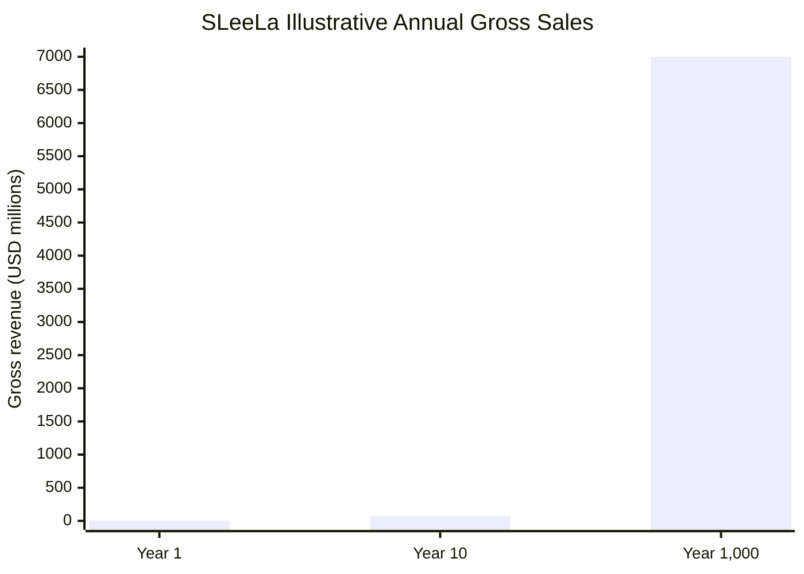
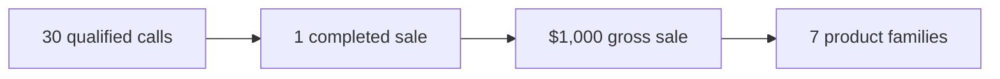

# SLeeLa Cost Estimation

**Document:** COST.ESTIMATION.md  
**Project:** SLeeLa  
**Basis:** Planning-level engineering labor estimate  
**Currency:** USD  
**Labor rate:** $55.00 USD/hour per professional  
**Planning team:** 12 professionals minimum  

> This document is a planning estimate, not an invoice, quote, bid, contract, or guarantee of final project cost. Actual effort depends on requirements, existing code quality, platform access, test hardware, third-party dependencies, security requirements, and the desired production-readiness level.

## 1. Estimation Basis

The minimum planning labor pool is **12 professionals at $55.00/hour**.

- 1 professional: **$55/hour**
- 12 professionals: **$660/hour**
- 8-hour day for 12 professionals: **$5,280/day**
- 40-hour week for 12 professionals: **$26,400/week**
- 160-hour month for 12 professionals: **$105,600/month**

The estimate deliberately uses a single transparent baseline rate rather than assigning different rates to individual specialties.

## 2. Project-Wide Work Areas

SLeeLa is substantially broader than the debugger. The estimate therefore includes the major engineering areas presently represented by the project.

| Work area | Planning hours |
|---|---:|
| Core C/C++ architecture and libraries | 1,200 |
| HTTP protocol family and packet processing | 1,600 |
| HTTP server and server-edition infrastructure | 1,400 |
| Networking, sockets, buffering, routing and message passing | 1,200 |
| Drivers and platform interfaces | 1,800 |
| Cross-platform Windows/Linux/macOS support | 1,200 |
| Debugger and native-debugging roadmap | 1,600 |
| Test Suite, regression, coverage and test infrastructure | 1,200 |
| Antivirus / heuristic / file-analysis subsystem | 900 |
| Decompiler and API tooling | 700 |
| GUI / API / documentation tooling | 700 |
| Security, signing, hashing and trust boundaries | 1,000 |
| SMTP/email and service components | 500 |
| XML/BODI/Slervlet™ tooling | 700 |
| Build, packaging, installation and deployment | 900 |
| Performance, reliability and failure testing | 900 |
| Documentation, examples and developer experience | 800 |
| Integration, release engineering and final QA | 1,000 |
| **Planning total** | **20,300** |

## 3. Baseline Labor Cost

At **$55/hour**:

**20,300 hours × $55/hour = $1,116,500 USD**

This is the baseline labor estimate for the work areas above.

## 4. Twelve-Professional Capacity

With 12 professionals working full-time:

**20,300 ÷ 12 = approximately 1,692 team-hours per professional**

At 40 hours/week:

**20,300 ÷ 480 = approximately 42.3 weeks**

Thus, with 12 full-time professionals and assuming the work can be effectively parallelized, the planning baseline is approximately **42 working weeks**.

The calendar duration may be longer because architecture, integration, security review, platform-specific work, and release validation contain dependencies.

## 5. Debugger Estimate

The debugger receives its own allocation because it contains native operating-system integration and substantially different testing requirements.

The current planning allocation is:

| Debugger area | Hours |
|---|---:|
| Debugger core/session/event model | 250 |
| C/C++ ABI and evidence model | 150 |
| Action controller and command model | 150 |
| Linux ptrace implementation | 350 |
| macOS LLDB integration | 250 |
| Windows Debug API integration | 300 |
| Breakpoints/watchpoints | 250 |
| Registers/memory/threads/stacks | 300 |
| DWARF/PDB/source mapping | 300 |
| Exceptions/signals/crash handling | 200 |
| Sanitizer/test integration | 150 |
| Record/replay and reproduction | 250 |
| DAP/terminal/voice interfaces | 200 |
| Native integration testing | 250 |
| Security and debugger trust boundaries | 150 |
| Documentation/release validation | 100 |
| **Debugger planning total** | **3,650 hours** |

Debugger labor baseline:

**3,650 × $55 = $200,750 USD**

This allocation is included within the project-wide estimate above and must **not** be added a second time.

## 6. Test and Quality Engineering

Testing is treated as engineering work rather than an afterthought.

The estimate includes:

- Unit testing
- C ABI testing
- C++ testing
- Cross-platform tests
- Native debugger integration tests
- HTTP protocol tests
- Packet and malformed-input tests
- Regression fixtures
- Sanitizer runs
- Crash/reproduction testing
- Performance testing
- Security boundary testing
- Release qualification

The 20,300-hour total already contains these activities.

## 7. Recommended Planning Reserve

A project of this breadth has material uncertainty. A planning reserve of **20%** is appropriate for estimation purposes.

20% of 20,300 hours:

**4,060 hours**

Reserve cost:

**4,060 × $55 = $223,300 USD**

### Planning total including reserve

**24,360 hours**

**24,360 × $55 = $1,339,800 USD**

## 8. Cost Summary

| Estimate | Hours | Cost |
|---|---:|---:|
| Core project labor | 20,300 | $1,116,500 |
| 20% planning reserve | 4,060 | $223,300 |
| **Planning total** | **24,360** | **$1,339,800** |

## 9. What This Estimate Does Not Include

Unless separately authorized, these figures do not establish costs for:

- Salaries or benefits above the stated $55/hour labor basis
- Office space
- Dedicated servers
- Cloud infrastructure
- Test devices
- Specialized debugging hardware
- Commercial SDKs
- Commercial compiler/tool licenses
- Third-party legal services
- Patent or trademark services
- External security audits
- Penetration-testing vendors
- Insurance
- Taxes
- Travel
- Hardware manufacturing
- Customer support operations
- Long-term maintenance after the estimated implementation period

## 10. Professional Team Model

The minimum 12-person planning group can be organized functionally as:

1. Lead systems architect
2. C/C++ systems engineer
3. Networking/HTTP engineer
4. Native debugger engineer
5. Linux systems engineer
6. Windows systems engineer
7. macOS systems engineer
8. Security engineer
9. Driver/platform engineer
10. Test/QA automation engineer
11. Build/release engineer
12. Documentation/API/integration engineer

These are planning roles, not assertions about actual staffing.

## 11. Cost Interpretation

The **$1,116,500** figure represents the baseline engineering labor represented by the current scope.

The **$1,339,800** figure represents a planning budget after adding a 20% uncertainty reserve.

Neither number should be interpreted as a fixed project price. A production contract should be based on a separately approved statement of work, milestones, acceptance criteria, staffing plan, and change-control process.

## 12. Estimation Formula

The project maintains a deliberately simple formula:

**Labor Cost = Engineering Hours × Hourly Rate**

For the minimum 12-professional team:

**Hourly team cost = 12 × $55 = $660/hour**

**Weekly team cost = 12 × 40 × $55 = $26,400/week**

**Monthly planning cost = 12 × 160 × $55 = $105,600/month**

## 14. Sales and Profit Scenario Model

This is an illustrative commercial scenario, not a forecast or guarantee. It assumes seven initial language/product families: Java, Perl, Python, C, C++, Rust, and a seventh "Other" family. The model assumes a strong launch, a constant $1,000 sale price, and 30 qualified phone calls per completed sale.

| Horizon | Copies / Family / Year | Seven-Family Copies / Year | Calls / Year | Gross Sales / Year |
|---|---:|---:|---:|---:|
| Year 1 — strong start | 1,000 | **7,000** | **210,000** | **$7,000,000** |
| Year 10 — mature scale | 10,000 | **70,000** | **2,100,000** | **$70,000,000** |
| Year 1,000 — illustrative scale | 1,000,000 | **7,000,000** | **210,000,000** | **$7,000,000,000** |

### Unit Economics

| Measure | Value |
|---|---:|
| Price per sale | **$1,000** |
| Calls per sale | **30** |
| Revenue per call | **$33.33** |
| Product families | **7** |

Using the previously modeled **$3,060,260 annual planning cost envelope**:

| Horizon | Gross Sales | Cost Envelope | Surplus Before Taxes/Other Costs |
|---|---:|---:|---:|
| Year 1 | $7,000,000 | $3,060,260 | **$3,939,740** |
| Year 10 | $70,000,000 | $3,060,260 | **$66,939,740** |
| Year 1,000 | $7,000,000,000 | $3,060,260 | **$6,996,939,740** |

The surplus is not net profit; taxes, payment costs, sales expenses, delivery, support, additional staffing, capital expenditure, reserves, and reinvestment remain outside this simplified model.

### Graphic Sales Model

### Sales Funnel

The Year 1,000 row is mathematical scenario analysis rather than a credible operational forecast.

## 15. Revision Control

This estimate should be revised whenever a major subsystem changes scope, including:

- New HTTP versions or protocol requirements
- New native debugger capabilities
- Additional operating systems
- New driver families
- New security requirements
- New GUI/API requirements
- New compiler or toolchain requirements
- New deployment targets
- New test or certification requirements

**Prepared for SLeeLa project planning.**

**MEARVK LLC — 2026**
