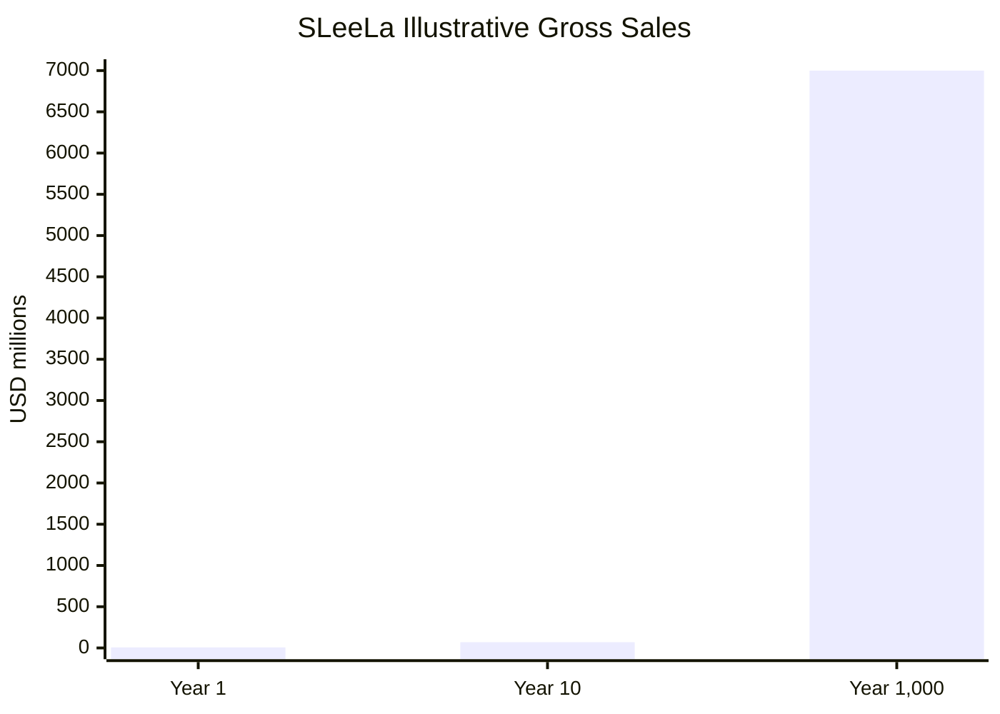
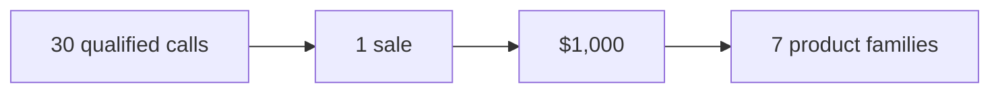

# SLeeLa — U.S. Government Cost Reserve Planning

**Document:** `COST.RESERVES.US.GOVT.md`  
**Project:** SLeeLa  
**Planning basis:** U.S. Government / institutional reserve planning  
**Currency:** USD  
**Baseline labor rate:** $55.00/hour per professional  
**Minimum planning team:** 12 professionals  
**Prepared:** 2026

> **Planning notice:** This document is a planning model only. It is not a federal budget request, appropriation, procurement action, contract, grant, government endorsement, or official U.S. Government cost estimate. Amounts should be independently reviewed by the responsible contracting, finance, acquisition, legal, and program offices before use in an official process.

## 1. Executive Reserve Table

| Planning Component | Hours | Rate | Labor Cost | Reserve / Basis |
|---|---:|---:|---:|---|
| Core SLeeLa engineering scope, including Debugger and Synchro | 23,250 | $55/hr | **$1,278,750** | Baseline |
| Munction native C/C++ subsystem | — | $55/hr | **TBD (no historical hours recorded)** | Separately tracked; not added to baseline |
| Synchro | 900 | $55/hr | **$49,500** | Included in baseline |
| Decompiler and API tooling | 700 | $55/hr | **$38,500** | Included in baseline |
| Planning uncertainty reserve | 4,650 | $55/hr | **$255,750** | 20% of baseline |
| **Total planning requirement** | **27,900** | **$55/hr** | **$1,534,500** | Baseline + reserve; subsystem rows included above |

## 2. Twelve-Professional Staffing Basis

| Item | Calculation | Result |
|---|---|---:|
| Professionals | Minimum team | **12** |
| Individual labor rate | Fixed planning assumption | **$55/hr** |
| Team hourly rate | 12 × $55 | **$660/hr** |
| Team daily rate | 12 × 8 × $55 | **$5,280/day** |
| Team weekly rate | 12 × 40 × $55 | **$26,400/week** |
| Team 160-hour month | 12 × 160 × $55 | **$105,600/month** |
| Baseline duration | 23,250 ÷ 480 team-hours/week | **~48.4 weeks** |

The 48.4-week figure is a mathematical capacity estimate, not a delivery guarantee. Dependencies, integration sequencing, reviews, procurement, security validation, and platform-specific work can extend calendar duration.

## 3. SLeeLa Scope Reserve Table

| Workstream | Planned Hours | Labor Cost @ $55/hr |
|---|---:|---:|
| Core C/C++ architecture and libraries | 1,200 | $66,000 |
| HTTP protocol family and packet processing | 1,600 | $88,000 |
| HTTP server / server-edition infrastructure | 1,400 | $77,000 |
| Networking, sockets, buffering, routing, message passing | 1,200 | $66,000 |
| Drivers and platform interfaces | 1,800 | $99,000 |
| Cross-platform Windows/Linux/macOS support | 1,200 | $66,000 |
| Debugger and native-debugging roadmap | 3,650 | $200,750 |
| Synchro packet dispatch, measurement, SLA and integration | 900 | $49,500 |
| Test Suite, regression, coverage and test infrastructure | 1,200 | $66,000 |
| Antivirus / heuristic / file-analysis subsystem | 900 | $49,500 |
| Decompiler and API tooling | 700 | $38,500 |
| GUI / API / documentation tooling | 700 | $38,500 |
| Security, signing, hashing and trust boundaries | 1,000 | $55,000 |
| SMTP/email and service components | 500 | $27,500 |
| XML/BODI/Slervlet™ tooling | 700 | $38,500 |
| Build, packaging, installation and deployment | 900 | $49,500 |
| Performance, reliability and failure testing | 900 | $49,500 |
| Documentation, examples and developer experience | 800 | $44,000 |
| Integration, release engineering and final QA | 1,000 | $55,000 |
| **Baseline Total** | **23,250** | **$1,278,750** |

### Scope accounting note

The previous 1,600-hour debugger allocation has been replaced by the detailed **3,650-hour Debugger** planning allocation below. The **900-hour Synchro** allocation is newly identified. This prevents either subsystem from being omitted while avoiding double-counting the Debugger subtotal.

The Synchro figure is a planning allocation, not a claim about historical labor actually spent. It covers the current packet contract, statistics, UDP measurement, SLA reporting, C/C++ integration, Java integration, test suite, CI integration, and remaining VM/multi-platform verification.

## 4. Debugger Reserve

The debugger is tracked separately for program-management visibility while remaining included in the project-wide baseline.

| Debugger Work Area | Hours | Cost |
|---|---:|---:|
| Debugger core/session/event model | 250 | $13,750 |
| C/C++ ABI and evidence model | 150 | $8,250 |
| Action controller and command model | 150 | $8,250 |
| Linux ptrace implementation | 350 | $19,250 |
| macOS LLDB integration | 250 | $13,750 |
| Windows Debug API integration | 300 | $16,500 |
| Breakpoints/watchpoints | 250 | $13,750 |
| Registers/memory/threads/stacks | 300 | $16,500 |
| DWARF/PDB/source mapping | 300 | $16,500 |
| Exceptions/signals/crash handling | 200 | $11,000 |
| Sanitizer/test integration | 150 | $8,250 |
| Record/replay and reproduction | 250 | $13,750 |
| DAP/terminal/voice interfaces | 200 | $11,000 |
| Native integration testing | 250 | $13,750 |
| Security and debugger trust boundaries | 150 | $8,250 |
| Documentation/release validation | 100 | $5,500 |
| **Debugger Subtotal** | **3,650** | **$200,750** |

**Important:** The $200,750 debugger subtotal is already contained within the $1,278,750 SLeeLa baseline. It must not be added again.

## 5. Synchro Reserve

Synchro is tracked as a distinct networking/measurement subsystem while remaining included in the project-wide baseline.

| Synchro Work Area | Hours | Cost |
|---|---:|---:|
| Packet contract and timestamped dispatch | 150 | $8,250 |
| C statistics and integration ABI | 175 | $9,625 |
| C++17 integration and runtime testing | 125 | $6,875 |
| Java dispatcher, statistics and SLA integration | 150 | $8,250 |
| UDP loopback and protocol-negative testing | 100 | $5,500 |
| CI/build integration and documentation | 100 | $5,500 |
| VM adapter and multi-platform verification allowance | 100 | $5,500 |
| **Synchro Subtotal** | **900** | **$49,500** |

**Important:** The $49,500 Synchro subtotal is already contained within the $1,278,750 SLeeLa baseline. It must not be added again.

## 6. Reserve Calculation

| Reserve Stage | Formula | Amount |
|---|---|---:|
| Baseline engineering | 23,250 × $55 | **$1,278,750** |
| 20% uncertainty reserve | $1,278,750 × 0.20 | **$255,750** |
| **Planning total** | $1,278,750 + $255,750 | **$1,534,500** |

### Reserve interpretation

The 20% reserve is intended to cover planning uncertainty such as:

- Requirements clarification
- Platform-specific implementation problems
- Native debugger integration complexity
- Synchro/transport integration and interoperability issues
- Cross-platform compatibility issues
- Test fixture expansion
- Security remediation
- Performance optimization
- Integration defects
- Toolchain differences
- Build/release problems
- Documentation and acceptance rework

It is **not** an authorization to spend the reserve automatically.

## 7. Proposed 12-Professional Planning Structure

| Role | Primary Planning Responsibility |
|---|---|
| 1. Lead Systems Architect | System architecture and integration |
| 2. C/C++ Systems Engineer | Core libraries and native implementation |
| 3. Networking / HTTP / Synchro Engineer | HTTP, packet, socket, routing and measurement systems |
| 4. Native Debugger Engineer | Debugger architecture and native APIs |
| 5. Linux Systems Engineer | Linux kernel/process/platform integration |
| 6. Windows Systems Engineer | Windows platform and Debug API integration |
| 7. macOS Systems Engineer | macOS/LLDB/platform integration |
| 8. Security Engineer | Security, trust, signing and hardening |
| 9. Driver / Platform Engineer | Hardware/software driver interfaces |
| 10. Test / QA Automation Engineer | Tests, coverage, regression and qualification |
| 11. Build / Release Engineer | Builds, packaging and deployment |
| 12. Documentation / API / Integration Engineer | APIs, examples, documentation and integration |

These are planning roles and do not establish an actual staffing commitment.

## 8. Government-Style Cost Controls

For institutional or government planning, the following controls are recommended:

| Control | Purpose |
|---|---|
| Baseline budget | Establishes approved initial scope |
| Reserve account | Separates uncertainty from baseline work |
| Change control | Prevents silent scope expansion |
| Milestone acceptance | Connects expenditure to measurable deliverables |
| Labor-hour tracking | Compares actual effort with estimate |
| Monthly variance review | Identifies cost/schedule drift |
| Independent technical review | Validates major architecture and security claims |
| Security review | Validates trust boundaries and remediation |
| Test evidence | Provides objective release qualification |
| Configuration management | Preserves reproducible source/build state |
| Audit trail | Records approvals, changes and expenditure decisions |

## 9. Excluded Costs

Unless separately authorized, the planning figures do not include:

- Federal salaries, benefits or agency overhead
- Contract administration overhead
- Office facilities
- Cloud hosting
- Dedicated servers
- Test hardware
- Specialized debugging hardware
- Commercial SDKs
- Commercial software licenses
- External security-audit contracts
- Penetration-testing vendors
- Legal services
- Patent/trademark services
- Insurance
- Taxes
- Travel
- Hardware manufacturing
- Operations and support after delivery
- Long-term maintenance
- Independent government accounting or audit fees

## 10. Cost Formula

The complete planning model uses:

**Labor Cost = Engineering Hours × $55/hour**

and:

**Planning Total = Baseline Labor + 20% Planning Reserve**

Therefore:

**23,250 hours × $55 = $1,278,750**

**$1,278,750 × 20% = $255,750**

**$1,278,750 + $255,750 = $1,534,500**

The principal subsystem allocations are:

**Debugger: 3,650 hours × $55 = $200,750**

**Synchro: 900 hours × $55 = $49,500**

Both amounts are included in the baseline above and are not additive charges on top of the $1,534,500 planning total.

## 11. Reserve Governance

A reserve should remain separately identifiable from the baseline.

Recommended authorization sequence:

1. Identify the new requirement or unexpected engineering condition.
2. Document the impact on scope, schedule, security, testing, or platform support.
3. Estimate incremental labor and non-labor costs.
4. Review against remaining reserve.
5. Obtain the applicable project/program approval.
6. Update the cost baseline and change record.
7. Record the resulting implementation and test evidence.

No reserve expenditure should be interpreted as automatically approved merely because the reserve exists.

## 12. Planning Status

| Measure | Current Planning Value |
|---|---:|
| Minimum professionals | **12** |
| Hourly rate / professional | **$55.00** |
| Team hourly rate | **$660.00** |
| Baseline hours | **23,250** |
| Baseline labor | **$1,278,750** |
| Debugger allocation | **3,650 hours / $200,750** |
| Synchro allocation | **900 hours / $49,500** |
| Reserve percentage | **20%** |
| Reserve hours | **4,650** |
| Reserve amount | **$255,750** |
| Total planning hours | **27,900** |
| **Total planning amount** | **$1,534,500** |

## 13. Illustrative Sales and Profit Scenario

This is an illustrative SLeeLa commercial scenario, not a forecast, appropriation, procurement estimate, or guarantee. It assumes seven initial language/product families: Java, Perl, Python, C, C++, Rust, and a seventh "Other" family. The model assumes a strong start, a $1,000 sale price, and 30 qualified phone calls per completed sale.

| Horizon | Copies / Family / Year | Seven-Family Copies / Year | Calls / Year | Gross Sales / Year |
|---|---:|---:|---:|---:|
| Year 1 — strong start | 1,000 | **7,000** | **210,000** | **$7,000,000** |
| Year 10 — mature scale | 10,000 | **70,000** | **2,100,000** | **$70,000,000** |
| Year 1,000 — illustrative scale | 1,000,000 | **7,000,000** | **210,000,000** | **$7,000,000,000** |

### Unit Economics

| Measure | Value |
|---|---:|
| Price per sale | **$1,000** |
| Calls per sale | **30** |
| Revenue per call | **$33.33** |
| Product families | **7** |
| Debugger planning allocation | **$200,750** |
| Synchro planning allocation | **$49,500** |
| Total engineering planning requirement | **$1,534,500** |

### Cost and surplus analysis

For a transparent cross-check, the **$1,534,500 total planning requirement** is used as the illustrative project-cost basis. It includes the 20% reserve and already includes both Debugger and Synchro.

| Horizon | Gross Sales | Total Planning Cost Basis | Illustrative Surplus Before Taxes/Other Costs |
|---|---:|---:|---:|
| Year 1 | $7,000,000 | $1,534,500 | **$5,465,500** |
| Year 10 | $70,000,000 | $1,534,500 | **$68,465,500** |
| Year 1,000 | $7,000,000,000 | $1,534,500 | **$6,998,465,500** |

These surplus figures are **not net profit** and are not forecasts. Taxes, payment processing, sales expenses, delivery, support, additional staffing, capital expenditure, operating expenses, reserves, reinvestment, and other costs remain outside this simplified scenario.

The commercial model therefore treats the Debugger and Synchro as real cost-bearing engineering components without counting either subsystem twice.

### Graphic Sales Model

### Sales Funnel

The Year 1,000 row is mathematical scenario analysis rather than a credible operational forecast.

## 14. Cost-Value Analysis

This section converts the planning baseline into decision-useful cost/value measures. It is an internal engineering economics analysis, not a forecast, procurement determination, or statement of realized commercial value.

### Cost basis

| Measure | Value |
|---|---:|
| Baseline engineering | **23,250 hours / $1,278,750** |
| Planning reserve | **4,650 hours / $255,750** |
| Total planning basis | **27,900 hours / $1,534,500** |
| Baseline duration at 12 professionals | **~48.4 weeks** |
| Total team capacity at 12 professionals | **480 hours/week** |

### One-time planning cost translated to the illustrative Year 1 sales case

Using the existing illustrative assumption of 7,000 Year 1 sales:

| Value Measure | Calculation | Result |
|---|---|---:|
| Planning cost per illustrative sale | $1,534,500 ÷ 7,000 | **$219.21** |
| Baseline cost per illustrative sale | $1,278,750 ÷ 7,000 | **$182.68** |
| Reserve per illustrative sale | $255,750 ÷ 7,000 | **$36.54** |
| Engineering hours per illustrative sale | 27,900 ÷ 7,000 | **3.99 hours** |
| Illustrative gross-sales / planning-cost ratio | $7,000,000 ÷ $1,534,500 | **4.56×** |

These are allocation metrics only. They do not establish that a sale will occur, that the sales assumptions are attainable, or that the planning cost is the complete cost of operating the product.

### Planning-cost recovery threshold

At the illustrative $1,000 price, the mathematical number of sales required to equal the $1,534,500 planning basis is:

**$1,534,500 ÷ $1,000 = 1,534.5 sales**

Therefore, the simplified planning-cost recovery threshold rounds to **1,535 sales**, before taxes, payment processing, sales costs, support, infrastructure, additional labor, and other operating expenses.

At 30 qualified calls per completed sale, the corresponding mathematical call volume is approximately:

**1,535 × 30 = 46,050 qualified calls**

This is a sensitivity metric, not a sales forecast.

### Value coverage by major engineering allocation

| Workstream | Planning Cost | Share of Baseline |
|---|---:|---:|
| Debugger | **$200,750** | **15.69%** |
| Synchro | **$49,500** | **3.87%** |
| Debugger + Synchro | **$250,250** | **19.57%** |
| All other baseline scope | **$1,028,500** | **80.43%** |

The Debugger and Synchro values are already included in the $1,278,750 baseline and must not be added again.

### Munction Cost-Value Analysis

Munction is now represented as a native C11/C++17 subsystem in addition to the existing Java implementation. The native implementation establishes a language-neutral semantic/channel contract, a C11 ABI, a C++17 RAII wrapper, native smoke tests, and dedicated CI. Its channel-callback design also allows existing pipe, file, TCP/network, HTTP, SDPS/private-packet, and cryptographic transport implementations to remain transport-specific rather than being duplicated inside the Munction core.

Because the native Munction implementation was introduced after the historical planning baseline, this document does **not** assign a retroactive dollar value to the work. The appropriate cost-value treatment is to identify the engineering dimensions now and attach measured labor as evidence becomes available.

| Munction Value / Cost Dimension | Current Analysis |
|---|---|
| Native semantic core | C11 provides a stable language-neutral contract for lifecycle, calls, movement, receipts, accounting, coherence, latching, closing and abort behavior. |
| C++17 usability | C++17 supplies a typed RAII/fluent interface over the C11 contract, reducing direct ABI handling for C++ consumers. |
| Cross-language consistency | The native layer creates a concrete conformance target alongside the existing Java implementation and SLeeLa VM. |
| Transport reuse | Callback-based channels permit existing transport implementations to be adapted without recreating every transport inside Munction. |
| Verification value | Native smoke tests and CI turn the C/C++ implementation into an independently buildable and repeatable qualification unit. |
| Integration value | A common contract provides a defined point for future VM adapters and C/C++/Java behavioral-conformance testing. |
| Cost treatment | No historical hours are invented. Actual labor should be recorded by implementation, wrapper, testing, integration, documentation and release-validation activity. |

#### Munction incremental cost model

Once actual engineering hours are recorded, the incremental Munction cost can be calculated transparently:

**Munction Labor Cost = Munction Engineering Hours × $55/hour**

A complete Munction accounting record should distinguish:

1. C11 core implementation
2. C++17 wrapper implementation
3. Native test and CI implementation
4. Java/native conformance testing
5. VM adapter and runtime integration
6. Transport/channel integration
7. Documentation and release validation
8. Platform-specific implementation and qualification
9. Munction-specific uncertainty reserve, if authorized

For example, if future timekeeping records **H** Munction engineering hours, then:

**Incremental Munction cost = H × $55**

and, if the project applies the same 20% planning-reserve convention:

**Munction planning basis = (H × $55) × 1.20**

These formulas are intentionally parameterized rather than populated with unsupported historical hours.

#### Munction value measures

Munction can also be evaluated through measurable engineering outcomes rather than an assumed commercial revenue allocation:

| Measure | Evidence to Track |
|---|---|
| Contract coverage | Number of lifecycle and channel semantics covered by C/C++ tests |
| Conformance | Matching behavior across C11, C++17, Java and VM implementations |
| Transport coverage | Number of supported channel adapters passing the common contract |
| Build reproducibility | Clean native builds and CI runs across supported toolchains |
| Defect containment | Munction-specific failures detected before integration/release |
| Integration reuse | Number of SLeeLa components consuming the common Munction contract |
| Maintenance leverage | Duplicate transport/semantic code avoided by shared interfaces |
| Release qualification | Native test, CI, documentation and integration evidence completed |

The principal cost-value distinction is therefore:

**Cost is measured in verified engineering hours; value is demonstrated through reusable semantics, interoperability, test evidence, defect containment, and integration leverage.**

Munction should be added to the formal baseline only after its actual effort or an explicitly approved prospective estimate is recorded. Until then, the existing $1,278,750 baseline and $1,534,500 total planning basis remain unchanged.

### Cost-value interpretation

The planning model supports five useful controls:

1. **Cost visibility:** every planned hour is assigned a common $55/hour planning basis.
2. **Reserve visibility:** the 20% uncertainty reserve is separated from the engineering baseline.
3. **Subsystem accountability:** Debugger and Synchro have explicit allocations without double counting.
4. **Recovery analysis:** the illustrative $1,000 unit price can be compared with the one-time planning basis using a transparent mathematical threshold.
5. **Change-control discipline:** newly introduced work, including future native subsystems not represented in the current baseline, should receive an explicit incremental estimate rather than being silently absorbed.

### Munction accounting note

The newly implemented native Munction C11/C++17 work is **not assigned a fabricated historical cost** in this document. The current baseline predates that explicit native Munction allocation. For formal cost control, Munction should therefore be treated as a separately identified scope item until engineering-hour evidence is collected.

A future Munction allocation should record, at minimum:

- C11 implementation hours
- C++17 wrapper hours
- test and CI hours
- Java/native conformance work
- VM adapter/integration work
- documentation and release validation
- any platform-specific implementation
- associated uncertainty reserve

This preserves the distinction between **actual recorded engineering effort**, **planning estimates**, and **commercial value scenarios**.

## 15. HTTP 4–9 Cost vs. Profit Evaluation

The HTTP 4–9 server family is now represented by six numbered native server programs under `http-servers/4` through `http-servers/9`. This section evaluates their engineering cost against the existing illustrative commercial model without treating sales assumptions as a forecast.

### Scope and cost treatment

The existing baseline already contains the following related planning categories:

| Existing Workstream | Baseline Hours | Planning Cost |
|---|---:|---:|
| HTTP protocol family and packet processing | 1,600 | $88,000 |
| HTTP server / server-edition infrastructure | 1,400 | $77,000 |
| **Related HTTP baseline** | **3,000** | **$165,000** |

The six new HTTP 4–9 programs are therefore treated as an extension of the existing HTTP/server scope rather than automatically added as another $165,000 charge. No historical hours are invented for the implementation just completed.

For prospective budgeting, the appropriate incremental formula is:

**HTTP 4–9 Incremental Labor Cost = Verified HTTP 4–9 Engineering Hours × $55/hour**

If the same 20% planning reserve is authorized for that incremental work:

**HTTP 4–9 Planning Cost = Incremental Labor Cost × 1.20**

This preserves the existing $1,278,750 baseline until actual timekeeping or an approved change estimate establishes an incremental amount.

### Engineering value represented by HTTP 4–9

| Server | Current Engineering Scope | Value Evidence |
|---|---|---|
| HTTP 4 | Binary session/frame handling, sequence validation, flow-control and lifecycle frames | Native packet parser, handshake gate and packet logging |
| HTTP 5 | HTTP 4 foundation plus Friends' Pack and audit-oriented extensions | Explicit extension frame types and logged packet identity |
| HTTP 6 | HTTP 5 foundation plus consolidated application/debate fields | Explicit extension identifiers and bounded frame processing |
| HTTP 7 | Semantic/assertion application protocol | Protocol-version gate and semantic response path |
| HTTP 8 | Handshake/subscription/radio/checker/session exchange | Explicit handshake requirement and state response |
| HTTP 9 | Identity/monitoring/international/Dark Band metadata | Explicit metadata exchange and configurable monitoring state |

These are SLeeLa application protocols and are not being represented as Internet-standard HTTP/4–HTTP/9 specifications.

### Cost-versus-value measures

The useful economic comparison is not simply source-code count. The relevant value measures are:

1. **Protocol coverage:** six additional executable server generations are now represented.
2. **Packet visibility:** packet/frame identity, stream, request, sequence and payload-length information can be logged.
3. **Handshake enforcement:** malformed or out-of-sequence initial exchanges can be rejected.
4. **Reusable server structure:** each numbered server has a build target and executable entry point.
5. **CI qualification:** the six server directories have a dedicated matrix build/smoke-test workflow.
6. **Future integration value:** the numbered servers provide concrete targets for the existing `/http` protocol definitions, client implementations, test vectors and later transport work.

### Illustrative commercial comparison

The existing commercial scenario assumes a $1,000 sale price and 7,000 Year-1 sales, producing $7,000,000 of gross sales.

| Measure | Calculation | Result |
|---|---|---:|
| Existing total planning basis | Baseline + 20% reserve | **$1,534,500** |
| Illustrative Year-1 gross sales | 7,000 × $1,000 | **$7,000,000** |
| Planning-cost allocation per Year-1 sale | $1,534,500 ÷ 7,000 | **$219.21/sale** |
| Illustrative gross-sales / planning-cost ratio | $7,000,000 ÷ $1,534,500 | **4.56×** |
| Existing planning-cost recovery threshold | $1,534,500 ÷ $1,000 | **1,535 sales** |

Because the HTTP 4–9 effort has not been assigned fabricated historical hours, these figures do **not** claim a separate HTTP 4–9 profit margin.

### Prospective incremental sensitivity

For future budgeting, the following examples show how incremental HTTP 4–9 engineering effort would translate into planning cost. These are mathematical sensitivities, not recorded project costs.

| Incremental Hours | Labor @ $55/hr | With 20% Reserve | Equivalent $1,000 Sales |
|---:|---:|---:|---:|
| 100 | $5,500 | $6,600 | 6.60 |
| 250 | $13,750 | $16,500 | 16.50 |
| 500 | $27,500 | $33,000 | 33.00 |
| 1,000 | $55,000 | $66,000 | 66.00 |
| 1,600 | $88,000 | $105,600 | 105.60 |

The last row corresponds to the existing HTTP protocol-family planning allocation and is shown only as a sensitivity reference; it is **not** an assertion that HTTP 4–9 consumed 1,600 hours.

### Gross contribution sensitivity

If the $1,000 selling price is retained and an incremental HTTP 4–9 planning cost is treated as a one-time engineering investment, the mathematical gross-sales amount required to equal that cost is:

**Required sales = Incremental HTTP 4–9 Planning Cost ÷ $1,000**

For example, a hypothetical 500-hour incremental estimate would be:

**500 × $55 × 1.20 = $33,000**

and:

**$33,000 ÷ $1,000 = 33 equivalent sales**

This is a cost-recovery calculation only. It is not net profit because it excludes taxes, payment processing, sales and marketing, customer support, hosting, infrastructure, additional labor, maintenance, and other operating expenses.

### Profit interpretation

The appropriate conclusion from the current evidence is:

- The HTTP 4–9 server family creates additional software capability and testable infrastructure.
- Its historical engineering cost should be recorded from actual timekeeping rather than inferred from the existence of source files.
- The existing $1,278,750 baseline and $1,534,500 planning total remain unchanged until an approved incremental estimate is made.
- Under the existing illustrative $1,000-sales model, any future incremental HTTP 4–9 cost can be translated directly into an equivalent sales recovery threshold.
- The resulting figures describe **gross-sales recovery and planning economics**, not realized net profit.

This keeps the cost model auditable and prevents the same HTTP engineering effort from being counted once in the original HTTP allocations and again as a new charge for HTTP 4–9.

## 16. Status and Authority

This document is an internal SLeeLa planning artifact. It does **not** represent:

- An official United States Government estimate
- A federal agency position
- An appropriation
- A solicitation
- A contract
- A grant
- A purchase order
- A government endorsement of SLeeLa
- A commitment of public funds

Any government use should replace or supplement this planning model with the applicable agency-specific acquisition, accounting, labor, indirect-cost, fiscal-year, and procurement requirements.

---

**SLeeLa — Cost Reserve Planning**  
**MEARVK LLC — 2026**
