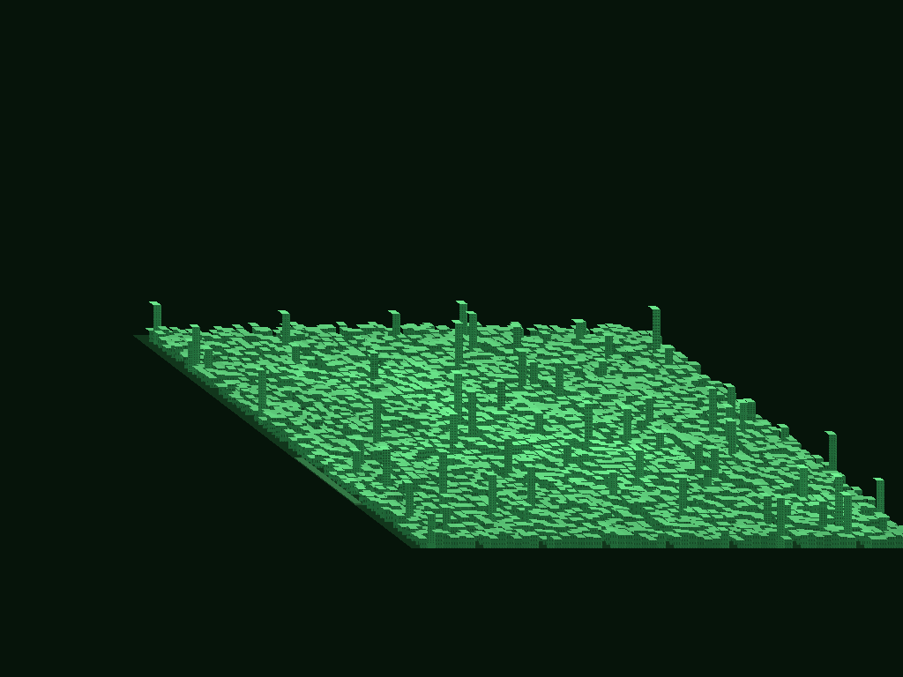
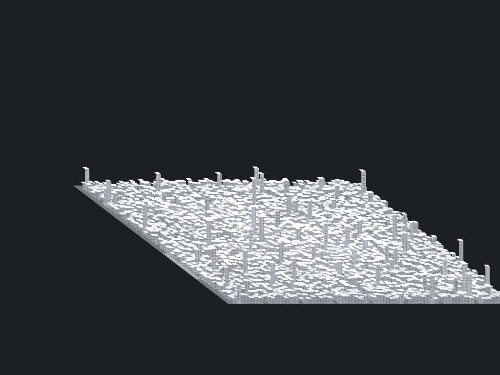
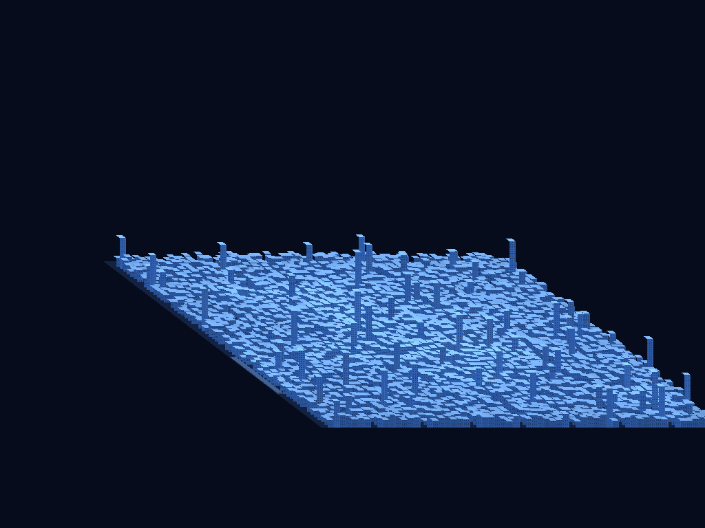

# model-3D — Phraign™ City 3D

**Phraign™ City 3D** generates a sprawling, modern city model of ~4000 square
blocks and renders it — on a **per-pixel basis** — onto a
[Phraign™](../PHRAIGN.md) frame. The city is a **model of finality** (quality of
condition) driven by a configurable **Year**: a more modern year (e.g. `2807`,
`2407`) yields a newer city with taller buildings, more floors and windows, and
better condition. It is viewed from the top and off to one side at a slight
angle, the whole viewpoint is config-driven, and a model is generated per user
and can be saved to GitHub or a public server.



## What it does

- **Sprawling city.** A square grid of blocks — default **64 × 64 = 4096**
  ("~4000 square blocks") — with a taller downtown core, real **road**
  corridors, **bridge** spans, and occasional landmark towers.
- **Year-driven modernity.** A config `year` sets the city's modernity
  (`clamp((year - baseline) / span, 0..1)`). Newer ⇒ taller buildings, more
  floors/windows/glass, and higher finality. `year = 2807` ⇒ modernity `0.81`;
  `year = 2050` ⇒ `0.05`.
- **Building quality attributes.** Each building has **floors**, **windows**, a
  **height** (`floors × floor_height`), and computed **proximity** to the
  nearest **road** and **bridge** — all config-tunable targets/weights.
- **Finality (quality of condition).** Each building gets a finality score in
  `[0,1]` — a normalized weighted mix of modernity, floors, windows, and the
  *computed* road/bridge proximity. The city-wide finality is reported and
  stored. Higher finality renders **brighter/cleaner**; lower renders
  darker/duller.
- **Per-user, reproducible.** Generated from a seed; with `seed = 0` the seed is
  derived from the `user` name, so every user gets their own reproducible city.
- **3D view, top + slight side angle.** An oblique projection draws each block as
  a lit roof, a lit side, a shaded side, plus **window** detailing and raised
  **bridge** decks. The viewpoint is fully driven by [`city.config`](city.config)
  — see [`CONFIG.md`](CONFIG.md).
- **Rendered through Phraign™, per pixel.** A small rendering stack —
  `render_math`, an ordered **rendering group** over a Phraign sink
  (`render_group`), and the city renderer on top — writes directly into a
  `sleela::terminal::PixelTerminal` frame via scanline polygon fill. See
  [`RENDER_MATH.md`](RENDER_MATH.md).
- **Color themes.** `green` (default), `white`, or `blue`, selected in the
  config; face brightness is modulated by each building's finality.
- **Save anywhere.** Models serialize to the plain-text `PHRAIGN-CITY` format
  ([`MODEL_FORMAT.md`](MODEL_FORMAT.md)) that lives well on GitHub or a public
  server; `city3d save` prints the save plan for the chosen target.

## Themes

| Green (default) | White | Blue |
|---|---|---|
|  |  |  |

## Layout

```text
model-3D/
├── README.md          this file
├── CONFIG.md          config file reference
├── MODEL_FORMAT.md    the PHRAIGN-CITY serialization format
├── city.config        default configuration
├── Makefile           self-contained build (pulls Phraign from ../)
├── RENDER_MATH.md     rendering math + rendering group reference
├── city_model.hpp/.cpp     model, palette, config, generation, serialization
├── render_math.hpp/.cpp    vectors, color math, oblique projection, quad fill
├── render_group.hpp/.cpp   RenderSink over Phraign + ordered drawable group
├── city_renderer.hpp/.cpp  builds a rendering group from a City and draws it
├── city3d.cpp              command-line driver (generate / render / save)
├── city3d_smoke.cpp        model/config/render smoke test
├── render_smoke.cpp        rendering math + group smoke test
├── samples/               rendered previews (green/white/blue)
└── modeling/              city model data (.city files)
```

## Build & run

```sh
cd bash/model-3D
make            # builds ./build/city3d and ./build/city3d_smoke
make smoke      # run the smoke test
make demo       # generate a model + a PPM preview from city.config

# Generate a per-user city, write the model and a preview image:
./build/city3d generate --config city.config --out modeling/mycity.city \
    --ppm build/mycity.ppm

# Render a saved model (optionally with a different view config):
./build/city3d render --model modeling/mycity.city --config city.config \
    --ppm build/mycity.ppm

# Print the save plan for the configured target (github|server|local):
./build/city3d save --model modeling/mycity.city --config city.config
```

The `--ppm` preview is a portable dump of the exact Phraign per-pixel frame,
viewable in any image viewer (or convertible to PNG).

## How the pieces relate

```text
city.config ──► Config ──► City.generate(seed)     (per-user, ~4000 blocks)
                              │
                              ▼
                     city_renderer ── builds quads via ──► render_math
                              │                            (ObliqueCamera, Quad)
                              ▼
                        render_group  (ordered quads, painter depth)
                              │  draw() per pixel via PhraignSink
                              ▼
                 Phraign™ PixelTerminal frame  ──►  preview (PPM/PNG)
                              │
                              ▼
        PHRAIGN-CITY model text  ──►  GitHub / public server / local
```

See [`../PHRAIGN.md`](../PHRAIGN.md) for the Phraign™ frame system this renders
onto.

## Notes & possible next steps

- The renderer builds a `render_group` of quads and draws them by a painter
  depth key with per-pixel scanline fills, which is exact for the convex block
  quads; there is no z-buffer, so it relies on draw order for occlusion.
- The `save` command currently prints the plan/commands for GitHub and public
  server targets rather than performing the network operation itself, keeping
  the tool dependency-free. Wiring it to actually push/upload would be a natural
  extension.
