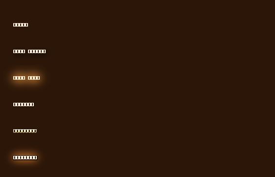

# SleelaUI™ Fonts & Font Effects

Fonts for Sleela and her UI — a **face** (family, size, weight, slant, spacing)
plus a stack of **effects** (shadows, light, glow, an emitter, outline, relief,
gradient fill), each with a **quality** knob. A styled string is drawn by the
toolkit's own rasterizer over an 8-bit glyph coverage mask, so it is
pixel-identical on Windows, macOS, and Linux/Unix, and it composes with the
[Draw API](DRAW-API.md) and the [Lighting](LIGHTING.md) layer.



*Plain, drop shadow, warm glow, outline, embossed + gradient, and the full
stack — on Sleela's warm base. Render display-free with `make font-snapshot`.
(The headless preview uses a schematic font; real backends render letterforms.)*

## Effects

Effects render **back-to-front in the order added**, so the add order is the
visual layering (shadows under the glyph, fill, then glow/outline/light on top).

| Effect | What it does | Builder |
|---|---|---|
| **Drop shadow** | an offset, blurred, dark copy behind the glyph | `slui_fx_drop_shadow(dx,dy,blur,color)` |
| **Inner shadow** | shadow *inside* the glyph (a pressed-in look) | `slui_fx_inner_shadow(dx,dy,blur,color)` |
| **Glow** | a soft coloured halo (additive — reads as emitted light) | `slui_fx_glow(radius,intensity,color)` |
| **Light** | a directional sheen lighting the glyph face | `slui_fx_light(dx,dy,intensity,color)` |
| **Emitter** | the text *radiates light into a scene* (see below) | `slui_fx_emitter(radius,intensity,color,anchor)` |
| **Outline** | a stroked edge of a chosen width + colour | `slui_fx_outline(width,color)` |
| **Relief** | emboss/engrave via lighting normals | `slui_fx_relief(EMBOSSED\|ENGRAVED,depth,intensity)` |
| **Gradient fill** | fill the glyph with a vertical gradient | `slui_fx_gradient_fill(top,bottom)` |

Light and shadow are emissions here just as in the Lighting layer: a **glow** or
**light** brightens, a **shadow** darkens, and an **emitter** radiates into a
scene.

### Sources and emitters, for text

The **emitter** effect follows the same source-vs-emitter rule as the rest of
SleelaUI. `slui_font_emit_into_scene(font, scene, x, baseline, text)` adds the
text's emission to a light scene:

- `anchor < 0` — a pure **emitter**: it radiates but reserves nothing, so the
  glowing text can light its neighbours yet stay free to carry more effects.
- `anchor >= 0` — a light **source**: it reserves that anchor (the text *is* the
  light; a second source on the same anchor is refused), exactly like
  `slui_light_scene_add_source`.

## Quality

Every effect honours the font's quality (`slui_font_set_quality`): draft → low →
medium → high → **ultra** scales the shadow/glow blur taps and the
outline/relief angular samples. Choose `SLUI_QUALITY_ULTRA` for the smoothest,
richest result; `SLUI_QUALITY_DRAFT` for the cheapest.

## Using it (C)

```c
#include "sleela_ui_font.h"

SLUIFont *f = slui_font_create("system", 28.0);
slui_font_set_weight(f, SLUI_FONT_BOLD);
slui_font_set_quality(f, SLUI_QUALITY_ULTRA);

slui_font_add_effect(f, slui_fx_drop_shadow(2, 4, 5, slui_rgb(0,0,0)));
slui_font_add_effect(f, slui_fx_glow(6, 0.9, slui_rgb(0xFF,0x9A,0x3C)));
slui_font_add_effect(f, slui_fx_outline(1.5, slui_rgb(0x20,0x10,0x06)));
slui_font_add_effect(f,
    slui_fx_gradient_fill(slui_rgb(0xFF,0xE6,0xC0), slui_rgb(0xD8,0x90,0x40)));

slui_font_draw(dc, f, "SleelaUI", 24, 48, slui_rgb(0xFF,0xF0,0xDC));
slui_font_destroy(f);
```

Give a widget a styled font so its label uses the effects:

```c
slui_widget_set_font(my_label, f);   /* the widget borrows the font */
```

A glowing sign that also lights the scene:

```c
SLUIFont *sign = slui_font_create("system", 36.0);
slui_font_add_effect(sign, slui_fx_glow(10, 1.2, slui_rgb(0xFF,0xC0,0x60)));
slui_font_add_effect(sign, slui_fx_emitter(80, 1.0, slui_rgb(0xFF,0xC0,0x60), -1));
slui_font_draw(dc, sign, "OPEN", 40, 80, slui_rgb(0xFF,0xF0,0xD0));
slui_font_emit_into_scene(sign, scene, 40, 80, "OPEN");  /* a pure emitter */
```

## Using it (SLeeLa)

```sleela
SLFont f = new SLFont();
f.create("system", 28.0);
f.setWeight(SLFont.BOLD);
f.setQuality(SLFont.QUALITY_ULTRA);

SLFontEffect sh = new SLFontEffect(); sh.dropShadow(2.0, 4.0, 5.0, 0x000000FF);
f.addEffect(sh);
SLFontEffect gl = new SLFontEffect(); gl.glow(6.0, 0.9, 0xFF9A3CFF);
f.addEffect(gl);
SLFontEffect gr = new SLFontEffect(); gr.gradientFill(0xFFE6C0FF, 0xD89040FF);
f.addEffect(gr);

label.setFont(f);                       // the widget's label now uses the font
```

## How it's produced

The string is rasterized once into an 8-bit coverage mask; every effect reuses
it. Shadows are box-blurred offset copies; the glow is an additive blurred halo;
the outline is the mask dilated by the stroke width; relief shades the fill by a
normal built from the coverage gradient; the gradient fill lerps across the glyph
band; and the light sheen adds a specular-style highlight along a direction. The
result composites into the Draw API context (and from there into the window), so
fonts, draw, lighting, and widgets are one coherent system.

— SleelaUI™ · MEARVK LLC · 2026
