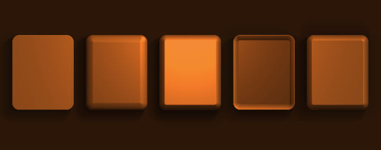

# SleelaUI™ Lighting, Shadow & Relief

Quality light, darkness, and **relief** for Canvas-aware objects. This layer
([`sleela_ui_light.h`](include/sleela_ui_light.h)) sits on top of the
[Draw API](DRAW-API.md): place lights, give an object a **material** with a
relief profile, and the renderer shades its pixels the way a scene is lit —
directional highlights, the raised/recessed look of genuine relief, a specular
sheen, soft **cast shadows** with real penumbrae, and ambient occlusion pooling
in the creases.



*Five relief profiles — flat, rounded, bevel, engraved, embossed — on Sleela's
deep warm base **#2B1608**, lit by a warm directional emitter and a point light
source, with a shadow emitter deepening the lower-right. Render display-free with
`make relief-snapshot`.*

## Sources and emitters

A light exists in a scene in one of two ways — the key distinction:

| | **Source** | **Emitter** |
|---|---|---|
| Reserves an anchor object? | **Yes** — the object is *used* as the light | **No** — reserves nothing |
| How many per anchor? | At most one (a second is refused) | Unlimited |
| Reusable / free-standing? | Bound to its object | Yes, shareable across scenes |
| Reach for it when… | a specific widget/shape *is* the light | ambient fills, a moving sun, a torch, darkness poured into a region |

An **emitter is a source without reserving the thing itself as used**. Add one
with `slui_light_scene_add_emitter`. A **source** is added with
`slui_light_scene_add_source(scene, anchor, light)`, which reserves `anchor`;
`slui_light_scene_anchor_reserved` reports it, and
`slui_light_scene_release_source` frees it.

## Light and shadow are both emissions

**Both light and shadow can come from either a source or an emitter.** A light's
**polarity** decides the sign:

- `SLUI_POLARITY_LIGHT` — brightens (a light).
- `SLUI_POLARITY_SHADOW` — darkens (a shadow / umbra), a first-class emission of
  darkness. `slui_shadow_point(...)` is the shorthand.

Treating darkness as something *emitted* (not merely "absence of light") is what
gives the relief its depth on a dark base like #2B1608.

## Kinds

| Kind | Shape of the light |
|---|---|
| `SLUI_LIGHT_POINT` | radiates from `(x,y)` with a `radius` and smooth falloff |
| `SLUI_LIGHT_DIRECTIONAL` | parallel rays from a direction — a "sun" |
| `SLUI_LIGHT_AMBIENT` | uniform fill, no position |

Each light also has a height `z` above the canvas plane (small `z` = grazing,
dramatic relief) and a `softness` (0..1) that widens cast-shadow penumbrae.

## Materials & relief

A **material** says how an object catches light. Its **relief profile** is a
height model the shading turns into surface normals:

| Profile | Look |
|---|---|
| `SLUI_RELIEF_FLAT` | no height — pure shading |
| `SLUI_RELIEF_ROUNDED` | a smooth dome / pillow (soft raised) |
| `SLUI_RELIEF_BEVEL` | a crisp chamfered edge (raised panel) |
| `SLUI_RELIEF_ENGRAVED` | inset — pressed *into* the floor |
| `SLUI_RELIEF_EMBOSSED` | raised — standing *off* the floor |

`SLUIMaterial` also carries `depth` (how pronounced), `gloss` (0 matte .. 1
mirror, the specular sheen), `occlusion` (crease darkening), and `edge_px`.

## Using it (C)

```c
#include "sleela_ui_light.h"

SLUILightScene *scene = slui_light_scene_create();
slui_light_scene_set_ambient(scene, 0.55, slui_rgb(0xFF,0xE8,0xCC));

/* a warm directional sun -- an emitter (reserves nothing) */
slui_light_scene_add_emitter(scene,
    slui_light_directional(-0.8, 0.9, 1.1, slui_rgb(0xFF,0xE6,0xC0)));

/* a point light that IS this button -- a source reserving the widget */
int anchor = (int)(intptr_t)my_button;
slui_light_scene_add_source(scene, anchor,
    slui_light_point(cx, cy, 220, 0.9, slui_rgb(0xFF,0xD0,0x90)));

/* darkness poured into a corner -- a shadow emitter */
slui_light_scene_add_emitter(scene,
    slui_shadow_point(W-60, H-40, 300, 0.6, slui_rgb(0x08,0x03,0x00)));

/* light a raised panel in one call: shadow + fill + relief */
SLUIMaterial m = slui_material(SLUI_RELIEF_EMBOSSED, 7.0);
m.gloss = 0.45; m.occlusion = 0.5;
slui_light_panel(dc, (SLUIRect){x,y,w,h}, 14.0,
                 slui_rgb(0x7A,0x45,0x1C), m, scene);
```

Or light a whole animated widget each frame:

```c
slui_widget_set_light_scene(canvas_view, scene,
                            slui_material(SLUI_RELIEF_ROUNDED, 6.0));
```

## Using it (SLeeLa)

```sleela
SLLightScene scene = new SLLightScene(); scene.create();
scene.setAmbient(0.55, 0xFFE8CCFF);

SLLight sun = new SLLight();
sun.directional(-0.8, 0.9, 1.1, 0xFFE6C0FF);
scene.addEmitter(sun);                      // an emitter, reserves nothing

SLLight lamp = new SLLight();
lamp.point(cx, cy, 220.0, 0.9, 0xFFD090FF);
scene.addSource(buttonAnchor, lamp);        // a source, reserves the button

SLLight dark = new SLLight();
dark.point(w - 60.0, h - 40.0, 300.0, 0.6, 0x080300FF);
dark.asShadow();                            // darkness is a first-class emission
scene.addEmitter(dark);

SLMaterial m = new SLMaterial(); m.embossed(7.0);
```

## How the quality is produced

For each pixel of the object the renderer builds the relief height field, takes
central-difference normals, then accumulates every light: a smooth falloff × N·L
diffuse term and a Blinn-Phong specular highlight for light polarity, a coloured
darkening for shadow polarity, plus scene ambient and crease occlusion. Cast
shadows are multi-sampled across the penumbra so the edge is soft. The result is
composited back as a *modulation* of the object's own colour, so an object keeps
its albedo but gains real relief — crisp even on the dark #2B1608 base.

— SleelaUI™ · MEARVK LLC · 2026
