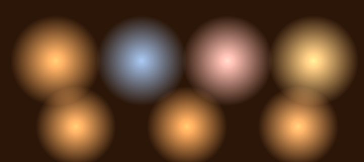

# SleelaUI™ Moods, Washes, Calculus-8 & Millimetre Light

An expressive layer over the [Lighting](LIGHTING.md) system: place a
light/dark/shadow emitter in real **millimetres** relative to the text's
font-paint location, drive **100 differentiables** through a **Calculus-8** into
a **Mood**, colour that mood from an **Excellent Wash**, and give it a **natural
tanor** — a portrait-quality glow for lightless bulbs that **refreshes** its
pattern "a little left."



*Top: warm, cool, tender, radiant moods as lightless-bulb tanor glows. Bottom:
one mood at three refresh phases, freshening a little left. `make mood-snapshot`.*

## Millimetre precision

A light shines down from some **mm of height** above where the text is painted,
and **left/right** and **up/down** mm offsets are supported too.

```c
SLUILight l = slui_light_point(0,0, 120, 1.0, 0xFFFFFFFF);
/* 10mm above the font origin, nudged 5mm left, at 96 dpi */
slui_light_place_mm(&l, font_x, font_baseline, slui_mm_left(5.0, 10.0), 96.0);
```

| mm builder | meaning |
|---|---|
| `slui_mm(right, down, height)` | full control (+right, +down, +height above the plane) |
| `slui_mm_left(mm, height)` / `slui_mm_right(mm, height)` | horizontal shift |
| `slui_mm_up(mm, height)` / `slui_mm_down(mm, height)` | vertical shift |

`slui_mm_to_px(mm, dpi)` resolves millimetres to device pixels (25.4 mm = 1
inch), so the light sits at the same physical place on any display. The height
becomes the light's elevation `z`, so a point light genuinely grazes the text
from that many millimetres up.

## Calculus-8 — 100 differentiables into a mood

A light's mood is driven by **100 differentiable inputs** evaluated through a
careful **8-stage calculus**. Each stage is a smooth, analytically
differentiable basis (identity, quadratic, smoothstep, sine, cosine, logistic,
gaussian, tanh); the stages are summed and squashed to a mood scalar in `[0,1]`.
Because every stage is differentiable, nudging an input moves the mood smoothly,
and `eval` returns both the mood **and the slope** `d(mood)/d(input)` so an
adjuster can follow the gradient straight into a mood.

```c
SLUICalculus8 *c = slui_calc8_create();
slui_calc8_set(c, 0, 0.9);          /* nudge differentiable 0 */
slui_calc8_set(c, 42, 0.3);
double slope;
double mood = slui_calc8_eval(c, 42, &slope);   /* mood + its slope wrt input 42 */
double stages[8];
slui_calc8_stages(c, stages, 8);    /* how the eight stages shaped it */
```

The analytic derivative is verified against a numeric slope in the test suite,
so "Calculus-8 is doable and differentiable" is a checked guarantee.

## Excellent Washes

A mood's colour comes from an **Excellent Wash**: a soft, multi-stop graded
colour field (up to 8 stops), sampled with smoothstep so it reads as a gentle
wash, not hard bands. Light colours are known and adjustable — the wash is how a
mood paints the light.

```c
SLUIWash w = slui_wash_triad(slui_rgb(0xFF,0xD9,0x9A),
                             slui_rgb(0xFF,0xA8,0x4C),
                             slui_rgb(0xC8,0x5A,0x22));
SLUIColor mid = slui_wash_sample(&w, 0.5);
```

## Natural tanor (lightless bulbs)

A **tanor** is a soft, portrait-quality ambient glow — a *light-of-effect* for
"lightless bulbs" with no hard source. It carries a **refresh** on the light
pattern and a gentle **"a little left"** bias in its freshing pattern, so the
glow breathes over time rather than sitting static.

```c
SLUITanor t = slui_tanor_default();  /* warm, soft, 0.5Hz refresh, a little left */
t.warmth = 0.8;        /* temperament 0 cool .. 1 warm */
t.diffusion = 0.85;    /* portrait softness */
t.refresh_hz = 0.6;    /* freshen the pattern */
t.left_bias = 0.25;    /* a little left */
```

## Moods — the one-call result

A **mood** = a wash + a tanor + a calculus. Applying it to a light sets the
light's colour (the wash sampled at the calculus's mood scalar, freshened by the
tanor's refresh + left bias) and folds the tanor's portrait softness and depth
into the light.

```c
SLUIMood *m = slui_mood_create(SLUI_MOOD_WARM);   /* a tasteful wash + tanor */
slui_mood_set_calculus(m, c);
SLUIColor now = slui_mood_color(m, time_s);        /* freshens over time */

/* colour an existing light by the mood */
slui_light_apply_mood(&light, m, time_s);

/* or build a mm-placed, mood-coloured emitter for text in one call */
SLUILight sign = slui_light_for_text(font_x, font_baseline,
                                     slui_mm_left(2, 12), 96.0, m, time_s,
                                     SLUI_LIGHT_EMITTER, SLUI_POLARITY_LIGHT,
                                     120, 1.0);
```

Built-in moods: `CALM`, `WARM`, `COOL`, `VIVID`, `SOMBER`, `TENDER`, `RADIANT`,
and `CUSTOM`. Both light and shadow emitters take moods — a `SLUI_POLARITY_SHADOW`
mood paints the darkness from its wash the same way light moods paint the glow.

## SLeeLa bindings

`SLMm` (millimetre placement), `SLWash` (excellent washes), `SLTanor`,
`SLCalculus8` (the 100 differentiables + 8 stages), and `SLMood` under
[`/lib/user-interface`](../lib/user-interface/USER-INTERFACE.md).

— SleelaUI™ · MEARVK LLC · 2026
