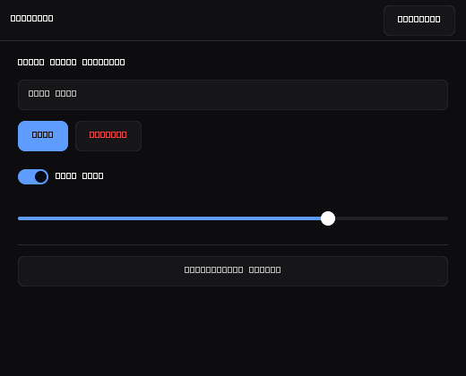

# SleelaUI™

**SLeeLa's own, original User Interface toolkit** — a self-contained C/C++
widget library with a software rasterizer and native per-OS backends. It is
**not** GTK, Qt, wxWidgets, or a wrapper around any of them: SleelaUI draws its
own widgets with its own 2D rasterizer, so its signature **Slick Black** matte
look is pixel-identical on every target. It talks to the real host window
system through one small backend interface with three implementations.

> SleelaUI™ — MEARVK LLC. Original SLeeLa work.



*The Slick Black default theme, rendered by the toolkit's own software
rasterizer. Regenerate with `make snapshot` (no display required). The schematic
text is the headless preview font; real backends render system glyphs.*

## Status & platform support

The toolkit follows the same cross-platform guarantee as the rest of SLeeLa:
one portable surface, native backends underneath, and the runtime can report
which backend is live (`slui_backend()` / `slui_backend_name()`).

| Platform | Window system | Backend | Font engine | Build |
|---|---|---|---|---|
| **Linux / Unix** | X11 (Xlib) | [`src/backend/x11.cpp`](src/backend/x11.cpp) | FreeType + Fontconfig | `make` |
| **macOS** (Darwin) | AppKit (NSWindow) | [`src/backend/cocoa.mm`](src/backend/cocoa.mm) | Core Text | `make` |
| **Windows 10+** | Win32 (user32/gdi32) | [`src/backend/win32.cpp`](src/backend/win32.cpp) | GDI (`GGO_GRAY8`) | `make` (MinGW) |

A fourth [`src/backend/headless.cpp`](src/backend/headless.cpp) backend renders
to memory with a built-in bitmap font so the whole toolkit — layout, painting,
theming — builds and smoke-tests on CI with **no display on any OS**.

## Architecture

```text
            your program (C or C++)
                     │
         include/sleela_ui.h  (stable C ABI)
                     │
     ┌───────────────┴────────────────┐
     │        portable core            │  no OS calls, identical everywhere
     │  Widget tree · box layout       │
     │  Theme (Slick Black default)    │
     │  Software rasterizer (Canvas)   │
     └───────────────┬────────────────┘
                     │  Backend interface (slui_backend.hpp)
     ┌───────────────┼────────────────┬──────────────┐
   X11 (Xlib)   Cocoa (AppKit)   Win32 (GDI)     Headless (CI)
```

The core makes **every** look-and-feel decision and produces the pixels. A
backend only has to be *correct*, never *styled*: create a native window,
translate input into `SLUIEvent`, rasterize a glyph to 8-bit coverage with the
real host font engine, and blit the `Canvas` buffer to the window.

See [`ARCHITECTURE.md`](ARCHITECTURE.md) for the full design and
[`UI-PRINCIPLES.md`](UI-PRINCIPLES.md) for the look-and-feel rules.

## The Slick Black theme

Slick Black is the default and signature palette: a matte near-black surface
family (the floor is a hair above pure black so antialiasing has somewhere to
blend), small even surface steps, crisp white text, and a single cool
steel-blue accent as "the one live thing." Every role pairing clears WCAG AA
contrast and every control clears a 32px hit target. The whole palette is one
struct — retheming is one edit, or load a `.conf` (see
[`THEMING.md`](THEMING.md)). A lighter `SLUI_THEME_GRAPHITE` preset and a fully
host-defined `SLUI_THEME_CUSTOM` are also provided.

## Control set

Containers: **box** (vertical/horizontal, GTK/CSS box model with expand +
align), **header bar**, **separator**, flexible **spacer**.
Controls: **label**, **button** (with suggested/destructive variants),
**toggle** switch, single-line **entry** with caret and UTF-8 editing,
**slider**. All are keyboard-navigable (Tab/Shift-Tab focus ring, Enter/Space
activate) and expose their state through the C ABI.

## Quick start (C)

```c
#include "sleela_ui.h"

int main(void) {
    SLUIApp *app = slui_app_create("com.example.App");

    SLUITheme theme;
    slui_theme_preset(&theme, SLUI_THEME_SLICK_BLACK);   /* the default */

    SLUIWindowConfig cfg = {0};
    cfg.title = "Hello"; cfg.width = 480; cfg.height = 320;
    cfg.resizable = 1; cfg.theme = &theme;

    SLUIWindow *win = slui_window_create(app, &cfg);
    SLUIWidget *root = slui_window_root(win);

    SLUIWidget *col = slui_box(root, SLUI_ORIENT_VERTICAL, 12);
    slui_widget_set_margin(col, 20, 20, 20, 20);
    slui_label(col, "Welcome to SleelaUI");
    SLUIWidget *ok = slui_button(col, "Continue");
    slui_widget_set_suggested(ok, 1);

    slui_window_show(win);
    return slui_app_run(app);
}
```

## Build

From `user-interface/`:

```sh
make           # build libsleelaui.a with the native backend for this OS
make example   # build the C gallery demo -> build/slui-gallery
make smoke     # build + run the headless smoke test (no display needed)
make install   # install the library, header, and desktop entry
```

The backend is auto-detected from the host (`make help` prints which one). On
Linux/Unix the X11 build needs the X11, FreeType, and Fontconfig development
packages; on Debian/Ubuntu:

```sh
sudo apt install libx11-dev libfreetype-dev libfontconfig-dev
```

Windows uses MinGW-w64 (links `gdi32`/`user32`); macOS uses Apple clang (links
the `Cocoa`, `CoreText`, and `CoreGraphics` frameworks).

## Run

```sh
./build/slui-gallery        # Slick Black window with every control
```

## Why "at least the quality of GNOME"

The toolkit adopts GNOME/GTK's two-pass box layout model, consistent 4px
spacing scale, one-accent-per-group discipline, always-visible focus ring, and
AA-contrast baseline — then goes further by rendering identically on all three
desktop platforms instead of inheriting three different native themes. The
rules are written down and enforced in [`UI-PRINCIPLES.md`](UI-PRINCIPLES.md).

— SleelaUI™ · MEARVK LLC · 2026