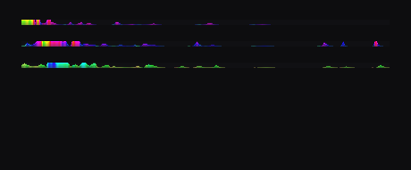

# SleelaUI™ Throbber — a water-like flowing activity field

The SleelaUI **Throbber** is not a spinning ring and not a marching marquee. It
is a **fluid field**: a thin strip of flowing water whose crests travel,
disperse, and recombine like ripples, lighting up in a colour that arrives
slightly **ahead** of the motion. It is **width-adjustable**, **full-motion**,
and **colour-predictive**, and it is tuned to *approach* the ease of real
flowing water — never to look busier or more mechanical than water.



*Three throbbers — calm (water-blue), medium (green water), and vigorous (warm)
— at different widths, rendered display-free with `make throbber-snapshot`.*

## The model

A one-dimensional field runs across the throbber's width, carrying a surface
**height** `h[i]` and a **velocity** `u[i]` per cell:

1. **Shallow-water update.** Each step, velocity follows the negative height
   gradient and height follows the divergence of `h·u` — a wave equation — plus
   a light viscosity that lets disturbances **disperse and recombine like real
   ripples** instead of sliding rigidly. Energy only ever dissipates between
   impulses, so the surface settles the way water does.

2. **Bounded, breathing drive.** A slow "amplification" field — a second-order
   oscillator with a **capped rate of change (bounded jerk)** — makes the whole
   field *speed up and slow down smoothly* rather than scrolling at a constant
   rate. This is the fluid evolution of the project's existing jerk-bounded
   title-bar throbber.

3. **Left-biased impulses, rightward flow.** Fresh water is fed in mostly from
   the left and carries rightward momentum, so crests are born, travel across,
   and fade — a source-to-sink flow, not a loop.

4. **Predictive colour.** A crest is coloured by *where it is about to be*: the
   hue is advanced along the base hue by the local velocity, so the colour
   **leads** the crest. Under strong amplification the saturation and hue spread
   widen — latent colour surfaces on the brightest, fastest crests — then recede
   as the field calms. The default base hue is an airy water-blue (205°).

5. **Width-adjustable.** The field uses about one cell per three pixels and
   **resamples** when the width changes, so a 40px seam and a 520px bar look
   like the same water at different crops — the wavelength and feel are
   preserved.

## "More natural than water? — no."

The parameters are deliberately chosen to **stay under** the naturalness of real
water, never to exceed it: acceleration is bounded, there are no instantaneous
jumps, viscosity keeps high frequencies from buzzing, and brightness is gated by
how fluid (not how frantic) the field currently is. The throbber reads as calm,
living water — the quiet "it's working" signal the UI principles ask for, with
no attention-grabbing flash.

## Using it

C:

```c
SLUIWidget *t = slui_throbber(root, 400);  /* initial width in pixels         */
slui_widget_set_size_request(t, 0, 24);     /* height (slim seam by default)   */
slui_throbber_set_width(t, 520);            /* adjust the width any time       */
slui_throbber_set_intensity(t, 0.7);        /* 0 = calm trickle .. 1 = vigorous*/
slui_throbber_set_hue(t, 205);              /* base hue (deg); 150 green, 30 warm */
```

SLeeLa:

```sleela
SLThrobber t = new SLThrobber();
t.createIn(root, 400);
t.setSizeRequest(0, 24);
t.setIntensity(0.7);
t.setHue(205.0);
```

The throbber is an **animated widget**: while visible, the window's frame loop
advances the field and repaints it at its refresh rate (default 60 FPS), driven
by the same frame-clock machinery exposed in the [Draw API](DRAW-API.md). No
render loop is required of the caller.

## How it's built

The Throbber is a thin subclass of the **Canvas View** widget, whose draw
callback is the water field above, painting through the public
[Draw API](DRAW-API.md) (`SLUI_BLEND_ADD` for light-accumulating crests, HSV for
the flowing hue). Any developer can build an equally rich visualisation the same
way — the throbber is simply the one the toolkit ships.

— SleelaUI™ · MEARVK LLC · 2026
